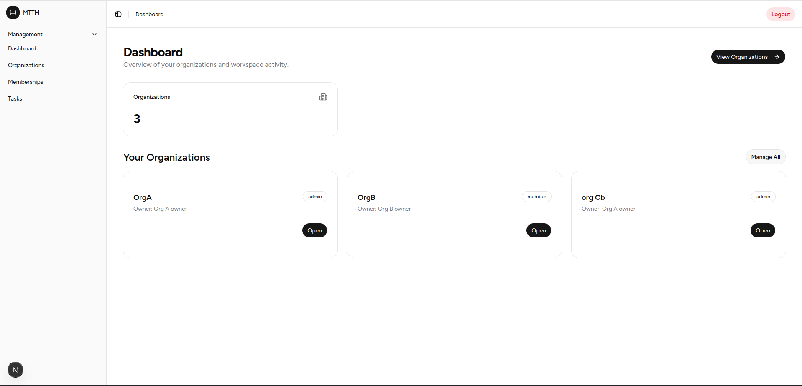
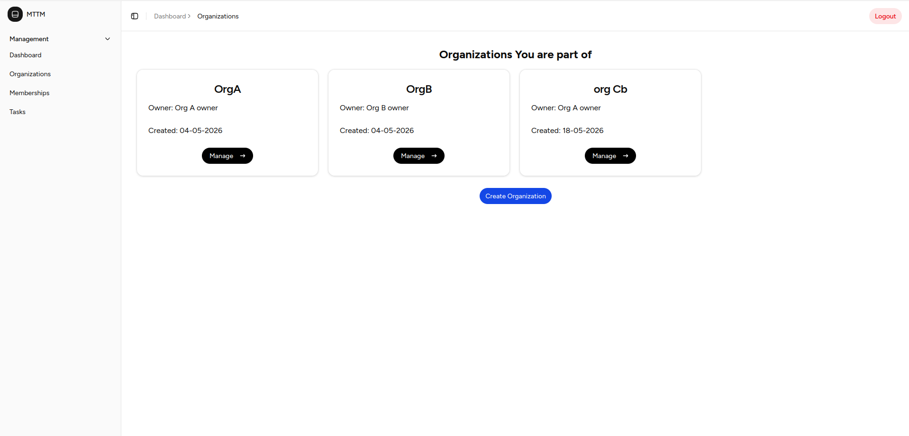
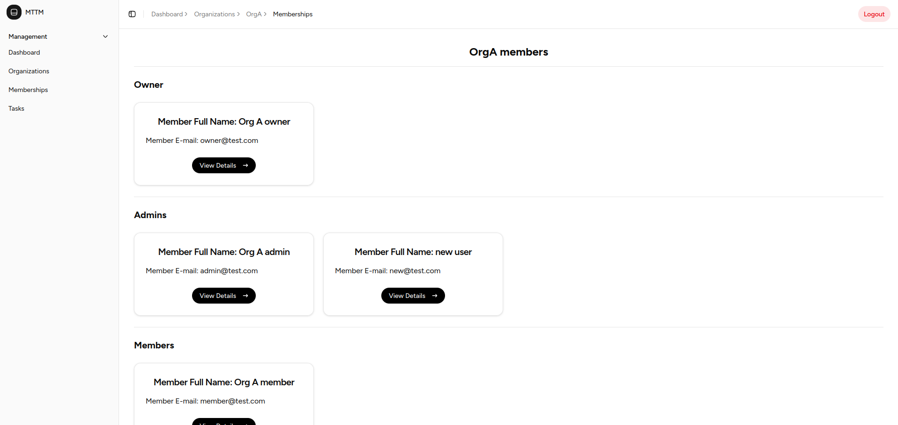
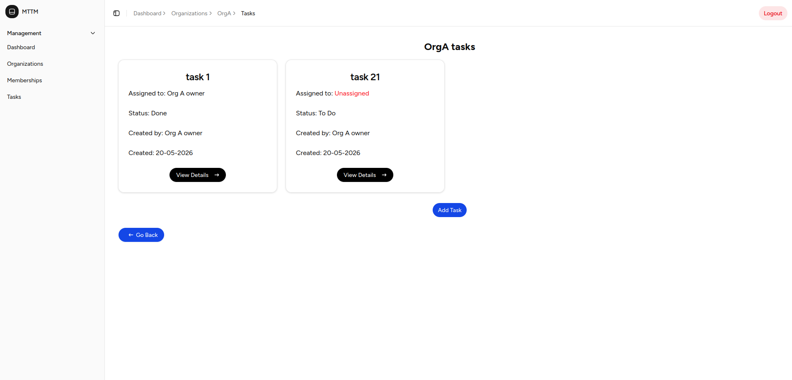

# Multi-Tenant Task Management System

A full-stack multi-tenant task management platform built with **Next.js**, **TypeScript**, **Django REST Framework**, and **PostgreSQL/SQLite**.  
The application supports organization-based collaboration with role-aware permissions, task assignment, membership management, JWT authentication, and responsive dashboard interfaces.

---

# Live Demo

> Frontend: Coming Soon  
> Backend API: Coming Soon

---

# Screenshots

## Dashboard



## Organizations



## Memberships



## Tasks



---

# Features

## Authentication & Authorization

- JWT authentication
- Login / Registration system
- Persistent authentication state
- Refresh token handling with Axios interceptors
- Protected routes
- Role-aware UI rendering

---

## Multi-Tenant Organizations

- Create organizations
- Update organizations
- Delete organizations
- Organization-specific data isolation
- Nested organization routing

---

## Membership Management

- Add members to organizations
- Assign organization roles
- Owner / Admin / Member role hierarchy
- Role-aware permissions
- Prevent invalid owner actions
- Responsive membership management UI

---

## Task Management

- Create tasks within organizations
- Assign tasks to organization members
- Edit and delete tasks
- Task assignment dropdowns
- Organization-scoped task management
- Responsive task dashboard

---

## Frontend Features

- Responsive dashboard layout
- Sidebar navigation
- Dynamic breadcrumbs
- Loading states
- Empty states
- Error handling
- Toast notifications
- Reusable dialogs and forms
- Role-aware action buttons
- Centralized API services
- Reusable custom hooks
- Type-safe frontend architecture using TypeScript

---

# Tech Stack

## Frontend

- Next.js (App Router)
- TypeScript
- React
- Tailwind CSS
- shadcn/ui
- Axios
- Lucide React

---

## Backend

- Django
- Django REST Framework
- JWT Authentication
- PostgreSQL / SQLite
- Custom permission classes

---

# Architecture Highlights

## Multi-Tenant Architecture

Organizations isolate memberships and tasks, ensuring tenant-specific data access and authorization.

---

## Role-Based Access Control (RBAC)

The application implements:

- Owner permissions
- Admin permissions
- Member permissions

UI actions dynamically adapt based on the authenticated user's role.

---

## Reusable Frontend Architecture

The frontend follows a scalable architecture using:

- Reusable hooks
- Centralized API services
- Shared utility functions
- Reusable CRUD dialogs
- Shared permission utilities

---

## Dynamic Dashboard Layout

The application uses:

- Shared dashboard layout
- Sidebar navigation
- Dynamic breadcrumbs
- Nested routing structure

---

# Project Structure

```plaintext
root/
│
├── frontend/
│   ├── src/
│   ├── public/
│   ├── package.json
│   └── ...
│
├── backend/
│   ├── manage.py
│   ├── requirements.txt
│   ├── apps/
│   └── ...
│
├── screenshots/
│
└── README.md
```

---

# Environment Variables

## Frontend

Create:

```plaintext
frontend/.env.local
```

Example:

```env
NEXT_PUBLIC_API_URL=http://127.0.0.1:8000/api
```

---

## Backend

Create:

```plaintext
backend/.env
```

Example:

```env
SECRET_KEY=your_secret_key_here
DEBUG=True
```

---

# Installation & Setup

# Backend Setup

## 1. Navigate to backend directory

```bash
cd backend
```

---

## 2. Create virtual environment

```bash
python -m venv venv
```

---

## 3. Activate virtual environment

### Windows

```bash
venv\Scripts\activate
```

### Linux / macOS

```bash
source venv/bin/activate
```

---

## 4. Install dependencies

```bash
pip install -r requirements.txt
```

---

## 5. Run migrations

```bash
python manage.py migrate
```

---

## 6. Start backend server

```bash
python manage.py runserver
```

Backend runs on:

```plaintext
http://127.0.0.1:8000
```

---

# Frontend Setup

## 1. Navigate to frontend directory

```bash
cd frontend
```

---

## 2. Install dependencies

```bash
npm install
```

---

## 3. Start development server

```bash
npm run dev
```

Frontend runs on:

```plaintext
http://localhost:3000
```

---

# Production Build

## Frontend

```bash
npm run build
```

---

# API Overview

## Authentication

- Register
- Login
- Refresh Token

---

## Organizations

- Get organizations
- Create organization
- Update organization
- Delete organization

---

## Memberships

- Get organization memberships
- Add member
- Update member role
- Remove member

---

## Tasks

- Get organization tasks
- Create task
- Update task
- Delete task

---

# Deployment

## Frontend

Recommended deployment:

- Vercel

---

## Backend

Recommended deployment:

- Render
- Railway

---

# Future Improvements

- Email invitations
- Task comments
- File attachments
- Activity logs
- Search and filtering
- Pagination
- Dark mode
- Real-time notifications

---

# Author

Developed by Essam Eldin Ali

- GitHub: https://github.com/3ssam-ali-98
- LinkedIn: https://linkedin.com/in/essam-eldin-ali

